# Design Mapper Skill



**The entry point for a modular AI design system.** Give it a brief — any brief — and it figures out which design skills to load, in what order, and what to focus on. Then it loads them automatically.

---

## The problem this solves

Good design decisions compound. The palette you choose should inform your effects. The effects should inform your icon weight. The fonts should match the palette mood. But without a coordinator, each decision gets made in isolation and you end up with a glass morphism card next to a slab serif over a pastel gradient — individually reasonable, collectively incoherent.

The mapper reads the whole brief, makes the routing decision once, and passes context forward so each skill builds on the last.

---

## The system

Five repos. Each one is a standalone skill that works on its own — but they're designed to work as a chain.

```
design-mapper-skill          ← you are here
│   Reads the brief. Detects signals. Emits a route. Loads skills in order.
│
├── color-combo-skill
│   161 palettes across 16 categories. WCAG contrast ratios on every palette.
│   CSS custom property templates. Dark mode variants. Gradient pairs.
│
├── design-effects-skill
│   Glass morphism, neumorphism, claymorphism, aurora, liquid glass, brutalism.
│   Copy-paste CSS vars per style. Page-type recipes. Motion and animation patterns.
│
├── font-pairing-skill
│   57 typeface pairings with Google Fonts @import URLs ready to paste.
│   Pairing rules, type scale, variable font guidance, loading strategy.
│
└── icon-system-skill
    Icon library selection (Lucide, Phosphor, Heroicons, Radix, Lordicon).
    Optical sizing system. Stroke vs fill decisions. currentColor patterns.
```

---

## How it works

### 1. You give it a brief

```
"Premium cocktail brand. Feels luxurious but a bit dark and mysterious.
Website + print collateral."
```

### 2. It detects signals and resolves the route

The mapper reads for three types of signals:
- **Industry** — craft brewery, spirits, bar → Gothic or Rustic
- **Mood** — "dark and mysterious" → overrides to Gothic / Dark Romance
- **Platform** — print context → skip design-effects (motion doesn't apply)

When signals conflict, explicit rules resolve them. Mood overrides industry. Accessibility overrides everything.

### 3. It emits a Design Route

```
╔══════════════════════════════════════╗
║         DESIGN ROUTE                 ║
╚══════════════════════════════════════╝
Brief:    Premium cocktail brand — dark, mysterious, luxury
Platform: web + print

Step 1 → color-combo-skill
  Category:  Gothic / Dark Romance
  Palette:   Bone & Wine
  Note:      Dark warm palette — editorial flat preferred over glass

Step 2 → design-effects-skill
  Focus:     editorial flat, subtle texture, dark shadows
  Suppress:  bright glass, animated motion, neon
  Note:      Serif-heavy type will dominate — icon use minimal or none

Step 3 → font-pairing-skill
  Archetype: editorial-dark
  Priority:  high-contrast display serif + light body
  Note:      Refined mood — skip icon-system unless web has UI components

Step 4 → icon-system-skill   [SKIP — branding/print context, no UI]

Confidence: HIGH
Adjustments: If the web presence includes e-commerce, reload icon-system for cart/nav
```

### 4. It applies each skill in sequence (auto mode)

After emitting the route, the mapper automatically loads and applies each skill in order — reading from your local `~/.claude/skills/` directory if installed, or fetching directly from GitHub if not. Each skill receives the carryover context from the step before it.

To get the route only without auto-applying: say *"just route, don't apply"*.

---

## Installing

### Full system (recommended)

Install the mapper first. On first load it will offer to install the companion skills:

```bash
npx skills add bilioveloso/design-mapper-skill
```

Or install everything at once:

```bash
npx skills add bilioveloso/design-mapper-skill
npx skills add bilioveloso/color-combo-skill
npx skills add bilioveloso/design-effects-skill
npx skills add bilioveloso/font-pairing-skill
npx skills add bilioveloso/icon-system-skill
```

### Claude Code plugin marketplace

```
/plugin marketplace add bilioveloso/design-mapper-skill
```

### Install individual skills only

Each skill is independently installable. If you only need color palettes:

```bash
npx skills add bilioveloso/color-combo-skill
```

---

## What each skill covers

### [color-combo-skill](https://github.com/bilioveloso/color-combo-skill)

161 named palettes organized into 16 categories: Luxury, Gothic, Minimalist, Corporate/Enterprise, Healthcare/Medical, Gaming/Esports, Rustic/Craft, Warm Tropical, Nature/Organic, Acid Contemporary, Retro/Vintage, Otherworldly, Soft Gradients, Luxury Facade, and Seasonal.

Every palette includes WCAG AA/AAA contrast ratios, CSS custom property templates (5 variables to swap the whole palette), dark mode variants, and gradient pair snippets. Also includes a Brand Archetype Guide mapping 12 Jungian archetypes to palette categories, and a Dark Mode Adaptation section.

### [design-effects-skill](https://github.com/bilioveloso/design-effects-skill)

Covers the visual layer decisions: which morphism style to use, which animation patterns fit the context, when to add depth vs. keep things flat, and what to avoid. Includes page-type recipes (SaaS landing, gaming page, wellness app, developer tool, etc.) so you can match a known archetype and skip the decision work.

New: CSS Quick Start section with copy-paste CSS custom properties and implementation checklists for Glassmorphism, Neumorphism, Claymorphism, Brutalism, Flat Design, Dark OLED, Aurora/Mesh Gradient, Liquid Glass, and Motion-Driven scroll reveal.

### [font-pairing-skill](https://github.com/bilioveloso/font-pairing-skill)

Typeface decisions organized by brand tier and mood. Includes pairing archetypes (editorial-dark, corporate-clean, gaming-display, wellness-calm, etc.), type scale guidance, variable font recommendations, and loading strategy (subsetting, font-display, preload).

New: Google Fonts @import Reference with 50+ ready-to-paste import URLs organized by category — Luxury/Editorial, Corporate/SaaS, Tech/Dev, Gaming, Editorial/News, Playful/Kids, and more. Fontshare CDN guidance for fonts not on Google Fonts.

### [icon-system-skill](https://github.com/bilioveloso/icon-system-skill)

Covers library selection (Lucide, Phosphor, Heroicons, Radix Icons, Lordicon), optical sizing (why 18px next to 16px body text feels better than 20px), stroke vs. fill decisions per context, and color inheritance via `currentColor`. Animated icon patterns for state change and delight moments.

Core rule: one library per project. Mixing icon sets destroys visual consistency even when each set looks good on its own.

---

## Why modular instead of one big skill

A single monolithic design skill has to cover every use case, which means it gets long, slow to load, and hard to maintain. When a new glassmorphism technique emerges, you update `design-effects-skill`. When a new color category is needed, you update `color-combo-skill`. The mapper doesn't need to change at all.

Each skill can also be installed and used independently. A developer who just needs icon guidance doesn't need 161 color palettes loading into their context.

---

## Signal coverage

The mapper's signal detectors cover **50+ industry/product categories** including:

SaaS · B2B Enterprise · Fintech/Banking · Legal · Healthcare · Wellness · Gaming/Esports · Luxury Brands · Fashion · E-commerce · Restaurant/Cafe · Craft Brewery · Travel/Resort · Eco/Sustainable · Music Events · Photography Studio · AI/Chatbot · NFT/Web3 · Mental Health · Smart Home/IoT · Dating App · Knowledge Base · Music Streaming · Video Streaming/OTT · Podcast · Food Delivery · Fitness/Gym · Job Board · Medical Clinic · Developer Tool/IDE · Cybersecurity · News/Media · Marketing Agency · Personal Finance · Remote Work/Collaboration · Creator Economy · Coworking · E-learning · Legal Tech · Real Estate · and more.

Mood modifiers (premium, minimal, dark, cyber, warm, bold, soft, nostalgic, natural) override or confirm the industry route. Platform context (mobile app, landing page, print, accessibility-first) adjusts what gets suppressed.

---

## Industry Anti-Patterns

The mapper also knows what to avoid per context. Some examples:

- **Finance / Banking / Legal / Healthcare / Government** — avoid AI purple/pink gradients (the purple→pink mesh gradient from AI branding signals "not serious" in trust-critical contexts)
- **B2B Enterprise** — avoid playful design and hidden credentials
- **Luxury E-commerce** — avoid vibrant/block-based styles and fast animations
- **Kids / Education** — avoid dark modes and complex jargon
- **Developer Tools / IDEs** — avoid light mode as default and slow performance

The full anti-patterns table is in [SKILL.md](SKILL.md).

---

## Pre-delivery checklist

Every route automatically emits this checklist:

```
[ ] SVG icons only — no emojis as icons
[ ] cursor-pointer on all clickable elements
[ ] Hover states: 150–300ms transition
[ ] Text contrast ≥4.5:1 minimum (WCAG AA)
[ ] Focus states visible for keyboard nav
[ ] prefers-reduced-motion respected
[ ] Responsive: 375px / 768px / 1024px / 1440px
[ ] No AI purple/pink gradients in finance, healthcare, legal, or government
```

---

## Contributing

Contributions welcome — signal mappings, new example runs, anti-pattern additions. See [CONTRIBUTING.md](CONTRIBUTING.md) for the format.

All changes go through PR. The `main` branch is protected — direct pushes are off for everyone except the maintainer.

## License

MIT — see [LICENSE](LICENSE).

## Maintained by

[@bilioveloso](https://github.com/bilioveloso)
